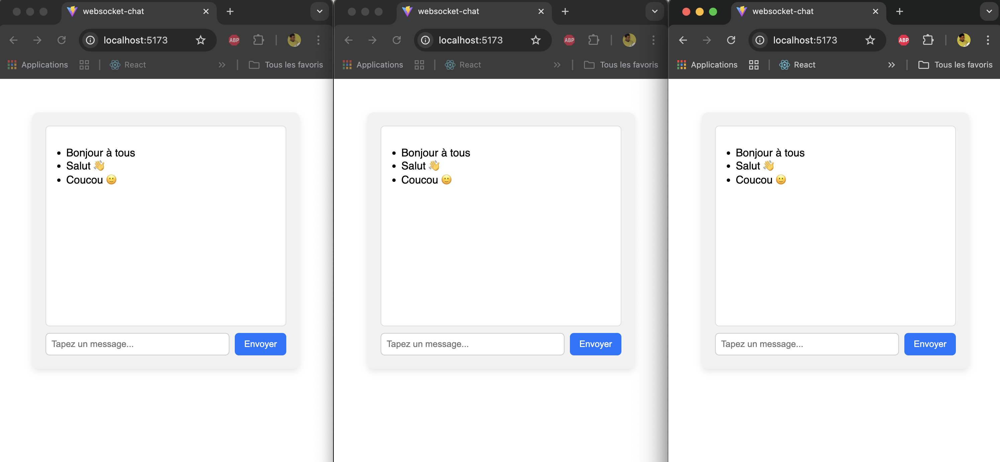

# WebSocket Chat (React + Vite + Node/ws)

A minimal real-time chat app with a React client (Vite + TypeScript) and a Node.js WebSocket server using `ws`.



## Features
- **Real-time messaging** via WebSockets
- **Broadcast** to all connected clients
- **Simple UI** with message list and input

## Tech Stack
- **Client**: React 19, Vite 7, TypeScript, ESLint
- **Server**: Node.js, ws

## Project Structure
```
chat-app-ws-react/
├─ client/           # React + Vite frontend (TypeScript)
│  ├─ src/App.tsx    # Chat UI and WebSocket client
│  ├─ vite.config.ts # Vite configuration
│  └─ package.json   # dev, build, lint, preview scripts
└─ server/           # WebSocket backend
   ├─ index.js       # WebSocketServer on ws://localhost:7500
   └─ package.json   # start script
```

## Prerequisites
- Node.js 18+ (recommended)
- npm 8+

## Setup
Install dependencies for both client and server:

```bash
# In client
npm install

# In server
npm install
```

## Running Locally
Run server and client in separate terminals.

- **Start server** (WebSocket on ws://localhost:7500):
  ```bash
  # from server/
  npm run start
  ```

- **Start client** (Vite dev server, typically http://localhost:5173):
  ```bash
  # from client/
  npm run dev
  ```

The client connects to `ws://localhost:7500` as configured in `client/src/App.tsx`.

## Build
- **Client** (build to `client/dist`):
  ```bash
  # from client/
  npm run build
  ```
- **Preview** production build:
  ```bash
  # from client/
  npm run preview
  ```

## Scripts
- **client/package.json**
  - `dev`: Vite dev server
  - `build`: TypeScript build + Vite build
  - `lint`: ESLint
  - `preview`: Vite preview server
- **server/package.json**
  - `start`: Start Node WebSocket server

## Configuration
- **WebSocket port**: defined in `server/index.js` (`PORT = 7500`).
- If you change the server port, update the URL in `client/src/App.tsx`:
  ```ts
  const ws = new WebSocket('ws://localhost:NEW_PORT');
  ```

## ESLint/Prettier
- Prettier config in `client/.prettierrc` and `server/.prettierrc`.
- ESLint configured via `client/eslint.config.js`.

## How It Works
- Server broadcasts any received message to all connected clients:
  ```js
  wss.on('connection', (ws) => {
    ws.on('message', (message) => {
      wss.clients.forEach((client) => {
        if (client.readyState === ws.OPEN) client.send(message.toString());
      });
    });
  });
  ```
- Client opens a WebSocket, appends incoming messages to state, and sends on Enter/click.

## Troubleshooting
- Ensure both processes are running (server on 7500, client on 5173 by default).
- Firewalls or corporate VPNs can block localhost WebSockets; try disabling or changing ports.
- If the client can’t connect, check the devtools console and server logs.

## License
ISC (see `server/package.json`).
